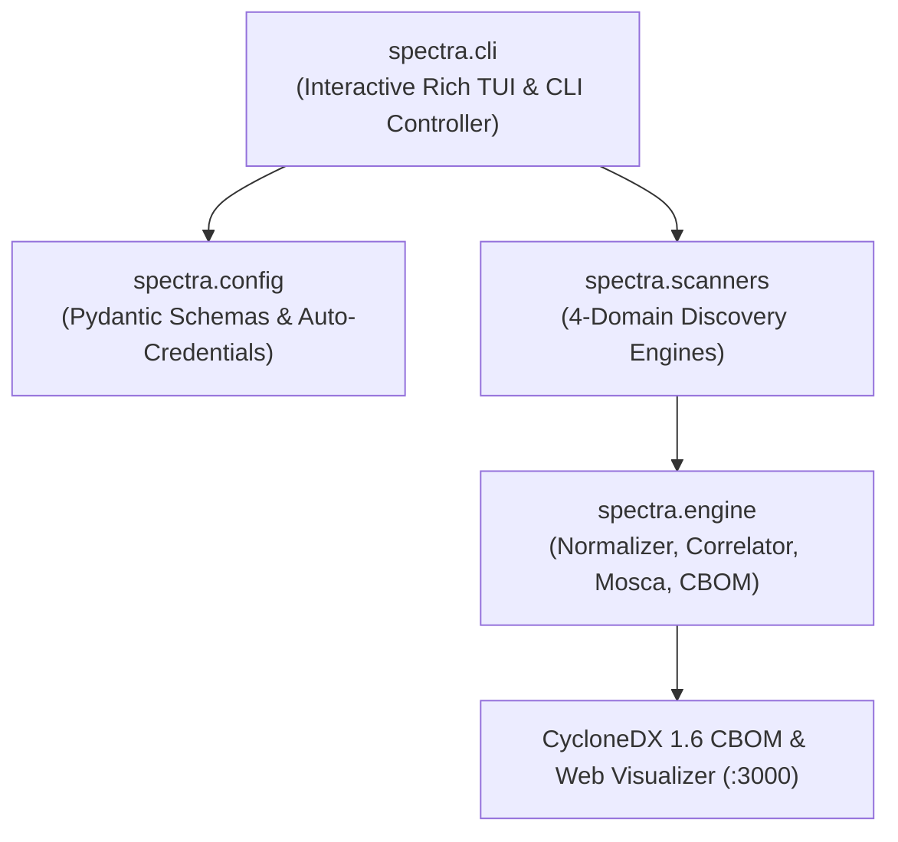

# SPECTRA Core Package (`spectra`)

[](https://python.org)
[](#architecture-overview)
[](#package-modules)

The `spectra` package is the core execution and orchestration root of **Project SPECTRA** (Enterprise Cryptographic Discovery & Analysis Tool / ECDAT). It houses the entry-point CLI, configuration management, and coordinates the discovery engines and analysis pipelines.

---

## Architecture Overview



---

## Package Modules

| Module | Role | Description |
| :--- | :--- | :--- |
| [`cli.py`](file:///C:/Users/Arnesh/spectra/spectra/cli.py) | **Operator Interface** | Command-line interface with interactive Rich TUI cards, preflight parameter verification, live scan progress tables, and automatic background web server spawning. |
| [`config.py`](file:///C:/Users/Arnesh/spectra/spectra/config.py) | **Configuration Engine** | Strongly-typed Pydantic schemas for scan boundaries, domain toggles, exclusions, and dynamic cloud credential discovery (AWS, Azure, GCP). |
| [`__init__.py`](file:///C:/Users/Arnesh/spectra/spectra/__init__.py) | **Package Root** | Exposes version metadata (`v1.0.0`) and public programmatic APIs for embedding SPECTRA into automated pipelines. |

---

## Key Sub-Packages

1. **[`spectra.scanners`](file:///C:/Users/Arnesh/spectra/spectra/scanners/README.md)**: Coordinates the 4-Domain discovery engines across Source Code (AST), Artifacts & Binaries, Infrastructure-as-Code (IaC), and Network & Cloud KMS.
2. **[`spectra.engine`](file:///C:/Users/Arnesh/spectra/spectra/engine/README.md)**: Normalizes raw findings, computes cross-domain blast radius call graphs, evaluates Mosca's Quantum Risk Inequality ($X + Y > Z$), and builds CycloneDX 1.6 CBOM JSON.
3. **[`spectra.utils`](file:///C:/Users/Arnesh/spectra/spectra/utils/README.md)**: Cross-platform system paths, Docker socket client, multi-cloud credential resolver, and logging primitives.

---

## Programmatic Usage

```python
from pathlib import Path
from spectra.config import ScanConfig, ScanTargets
from spectra.scanners import MasterScanner
from spectra.engine.normalizer import FindingNormalizer
from spectra.engine.cbom_builder import CBOMBuilder

# 1. Define target configuration
config = ScanConfig(
    targets=ScanTargets(paths=[Path("/path/to/project")]),
)

# 2. Execute 4-domain scan
scanner = MasterScanner(config)
raw_findings = scanner.scan_all()

# 3. Normalize and generate CycloneDX 1.6 CBOM
normalizer = FindingNormalizer()
normalized_assets = normalizer.normalize(raw_findings)

builder = CBOMBuilder()
cbom_doc = builder.build_cbom(normalized_assets)
print(f"Discovered {len(cbom_doc.components)} cryptographic components.")
```
