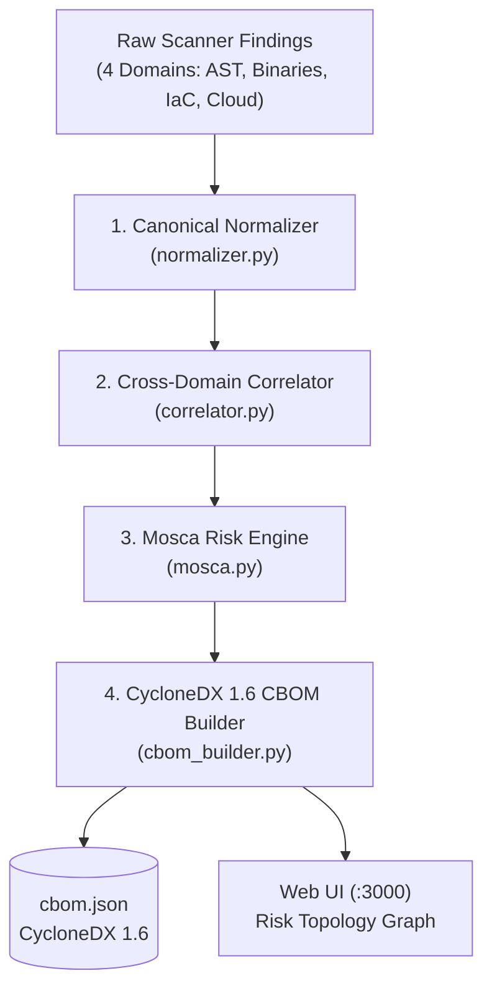

# SPECTRA Analysis & Risk Engine (`spectra.engine`)

The `spectra.engine` package is the analytical core of Project SPECTRA. It receives disparate raw findings from the 4-domain scanners (Source ASTs, Binaries, IaC, Network/Cloud) and transforms them into normalized cryptographic assets, computes cross-domain call-graph blast radiuses, evaluates quantum vulnerability using Mosca's Inequality, and exports standardized **CycloneDX 1.6 Cryptographic Bill of Materials (CBOM)** JSON.

---

## 4-Phase Analytical Pipeline

---

## Module Breakdown

| Module | Core Role | Key Outputs |
| :--- | :--- | :--- |
| [`normalizer.py`](file:///C:/Users/Arnesh/spectra/spectra/engine/normalizer.py) | **Canonical Schema Normalization** | Converts domain-specific finding objects (`SourceFinding`, `BinaryFinding`, `AWSFinding`, etc.) into unified `NormalizedCryptoAsset` models with standardized algorithm naming (NIST/OQS aliases). |
| [`correlator.py`](file:///C:/Users/Arnesh/spectra/spectra/engine/correlator.py) | **Blast-Radius & Call-Graph Correlation** | Calculates quantitative call counts (direct $X$, transitive $Y$) and maps relationships between high-level business endpoints and low-level cryptographic libraries. |
| [`mosca.py`](file:///C:/Users/Arnesh/spectra/spectra/engine/mosca.py) | **Quantum Risk Simulation** | Evaluates **Mosca's Inequality** ($X + Y > Z$) across 3 threat horizons (5, 10, 15 years), categorizes Shor/Grover vulnerability, and maps migration targets to NIST FIPS 203/204/205. |
| [`cbom_builder.py`](file:///C:/Users/Arnesh/spectra/spectra/engine/cbom_builder.py) | **CycloneDX 1.6 CBOM Generation** | Emits standardized machine-readable CBOM JSON adhering to OWASP CycloneDX 1.6 (ECMA-424) and CERT-In national guidelines. |

---

## Technical Details

### 1. Canonical Normalizer (`normalizer.py`)
- Standardizes algorithm names across diverse ecosystem naming conventions (e.g. mapping `AES-256-GCM`, `EVP_aes_256_gcm`, and `Cipher.getInstance("AES/GCM/...")` to a canonical `AES` primitive with `256` key length and `GCM` mode).
- Assigns cryptographic primitive classifications: Asymmetric Key Exchange (KEM), Digital Signatures (DSA), Symmetric Ciphers (AEAD), and Cryptographic Hashes (HASH).

### 2. Blast-Radius Correlator (`correlator.py`)
- Traces direct and indirect dependencies to compute the structural blast radius if an algorithm is compromised.
- Distinguishes between localized algorithm usage (e.g. single utility file) versus pervasive foundation primitives called across hundreds of downstream microservice endpoints.

### 3. Mosca Quantum Risk Simulation (`mosca.py`)
Evaluates the mathematical condition:
$$\text{If } X + Y > Z \implies \text{Data is compromised under the "Harvest Now, Decrypt Later" (HNDL) vector.}$$

- **$X$ (Data Shelf-Life):** Derived dynamically from context (healthcare/banking: 15–25 yrs; session keys: 1–2 yrs).
- **$Y$ (Migration Time):** Calculated dynamically using a COCOMO II-inspired effort model based on lines of code, cryptographic call-site density, and structural coupling.
- **$Z$ (Quantum Horizon):** Evaluated across Optimistic (15 yrs), Central (10 yrs), and Pessimistic (5 yrs) scenarios.
- **PQC Target Mapping:**
  - Classical Key Exchange (`RSA`, `ECDH`, `X25519`) ➔ **NIST FIPS 203 (ML-KEM / Kyber)**
  - Classical Signatures (`RSA-PSS`, `ECDSA`, `Ed25519`) ➔ **NIST FIPS 204 (ML-DSA / Dilithium)**
  - Stateless Hash Fallback ➔ **NIST FIPS 205 (SLH-DSA / SPHINCS+)**

### 4. CycloneDX 1.6 CBOM Builder (`cbom_builder.py`)
Generates the official CBOM artifact containing:
- Component definitions with exact source locations and line ranges.
- Cryptographic algorithm properties (`primitive`, `keyLength`, `mode`, `padding`).
- Quantum vulnerability status (`vulnerable`, `safe`, `transitional`).
- Certification and compliance metadata ready for CERT-In submission.
