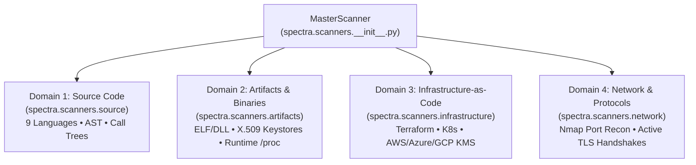

# SPECTRA 4-Domain Scanners (`spectra.scanners`)

The `spectra.scanners` package orchestrates multi-domain cryptographic asset discovery across modern enterprise application and infrastructure stacks. It implements a unified, master orchestration architecture (`MasterScanner`) that coordinates four specialized discovery domains.

---

## The 4 Discovery Domains

---

## Domain Sub-Packages

| Sub-Package | Primary Focus | Key Technologies |
| :--- | :--- | :--- |
| **[`source/`](file:///C:/Users/Arnesh/spectra/spectra/scanners/source/README.md)** | Source code AST & dependency graphs | Python `ast`, Tree-sitter, RipGrep pre-filter, 7 package lockfile parsers. |
| **[`artifacts/`](file:///C:/Users/Arnesh/spectra/spectra/scanners/artifacts/README.md)** | Compiled binaries, certificates & runtime memory | `readelf`, `objdump`, OpenSSL X.509 parser, Mozilla Root CA store, `/proc` memory maps. |
| **[`infrastructure/`](file:///C:/Users/Arnesh/spectra/spectra/scanners/infrastructure/README.md)** | Cloud KMS & Infrastructure-as-Code | AWS KMS (`boto3`), Azure Key Vault, GCP Cloud KMS, Terraform (`.tf`), Kubernetes manifests. |
| **[`network/`](file:///C:/Users/Arnesh/spectra/spectra/scanners/network/README.md)** | Exposed network ports & TLS protocols | Nmap network discovery (`--net=host`), active OpenSSL TLS client handshakes, Nginx/Apache configs. |

---

## Orchestration & Candidate Selection

1. **High-Speed Blind Pre-Filtering**: Before invoking heavy AST or binary parsers, `MasterScanner` executes high-speed ripgrep pre-filters that honor `.gitignore`, bypassing non-cryptographic files and reducing downstream tree-parsing workloads by over 80%.
2. **Parallel Domain Dispatch**: Scanners across code, infrastructure, and network run in parallel worker pools to maximize throughput on multi-core systems.
3. **Telemetry & Live Callbacks**: Emits real-time progress events to the Rich TUI in `spectra.cli` and telemetry logs.

---

## Safety & Agentless Model

- **100% Read-Only**: All local filesystems and container root filesystems are mounted with strict read-only (`:ro`) flags.
- **Zero Host Mutation**: No agent binaries, daemons, or background services are installed on the target machine.
- **Passive Inspection**: Network recon and TLS handshakes use standard client-side probes without intrusive exploitation payloads.
