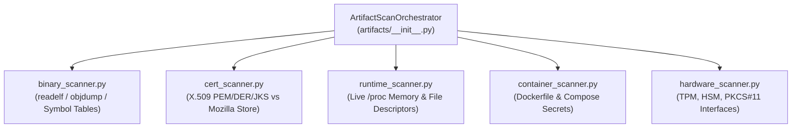

# Artifacts & Binary Reconnaissance (`spectra.scanners.artifacts`)

The `spectra.scanners.artifacts` package audits compiled binaries, cryptographic certificate stores, private keys, container packaging configurations, hardware security interfaces, and live process runtime memory.

---

## Architecture Overview

---

## Scanner Modules

| Module | Inspection Target | Key Extraction Methods |
| :--- | :--- | :--- |
| [`binary_scanner.py`](file:///C:/Users/Arnesh/spectra/spectra/scanners/artifacts/binary_scanner.py) | **Compiled Executables & Libraries** | Disassembles ELF, PE (`.dll`), Mach-O, and shared objects (`.so`) using `readelf` and `objdump` wrappers. Extracts imported crypto symbols (e.g. `EVP_EncryptInit`, `crypto_sign`), embedded keys, and static algorithm signatures. |
| [`cert_scanner.py`](file:///C:/Users/Arnesh/spectra/spectra/scanners/artifacts/cert_scanner.py) | **X.509 Certificates & Private Keys** | Inspects `.pem`, `.crt`, `.key`, `.der`, `.p12`, and Java KeyStores (JKS). Extracts public key algorithms (RSA-2048, ECDSA-P256), signature hashes, and validity horizons. Compares against the **Mozilla Root CA Keystore** to isolate proprietary certs from OS public roots. |
| [`runtime_scanner.py`](file:///C:/Users/Arnesh/spectra/spectra/scanners/artifacts/runtime_scanner.py) | **Live Process Runtime Memory** | Uses host PID access (`--pid=host`) to inspect live `/proc` process memory maps, open file descriptors, and loaded crypto shared libraries in memory. |
| [`container_scanner.py`](file:///C:/Users/Arnesh/spectra/spectra/scanners/artifacts/container_scanner.py) | **Container Image Definitions** | Scans `Dockerfile`, `docker-compose.yml`, and container configurations for embedded private keys, unencrypted secrets, and insecure base images. |
| [`hardware_scanner.py`](file:///C:/Users/Arnesh/spectra/spectra/scanners/artifacts/hardware_scanner.py) | **Hardware Security Modules (HSM/TPM)** | Detects physical and virtual TPM chips, PKCS#11 socket daemons (`/var/run/hsm.sock`), and CPU hardware acceleration extensions (AES-NI). |

---

## Key Technical Breakthroughs

1. **Mozilla Root Keystore Baseline**: Operating systems carry hundreds of standard public certificates. SPECTRA cross-references certificates against the Mozilla Root CA Keystore, instantly surfacing proprietary internal, self-signed, and expired certificates without alerting on standard system trust roots.
2. **Deep Binary Introspection**: Uncovers compiled cryptography even when source code is completely absent or proprietary third-party binaries are deployed.
3. **Runtime Process Correlation**: Validates that cryptographic libraries identified on disk are actually loaded and executing in live memory.
