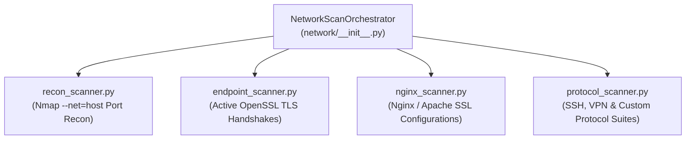

# Network & Protocol Reconnaissance (`spectra.scanners.network`)

The `spectra.scanners.network` package conducts live network endpoint discovery, port reconnaissance, active TLS client handshakes, and web server configuration audits across local and containerized environments.

---

## Architecture Overview

---

## Scanner Modules

| Module | Core Role | Technical Methodology |
| :--- | :--- | :--- |
| [`recon_scanner.py`](file:///C:/Users/Arnesh/spectra/spectra/scanners/network/recon_scanner.py) | **Port & Service Reconnaissance** | Uses host-mode Nmap (`--net=host`) to identify open listening ports (e.g. 443, 8443, 22, 6443) on localhost, container bridges, and local subnets. Flags exposed services requiring cryptographic inspection. |
| [`endpoint_scanner.py`](file:///C:/Users/Arnesh/spectra/spectra/scanners/network/endpoint_scanner.py) | **Active TLS Handshakes** | Executes automated client TLS handshakes against discovered domains and IP:port endpoints using OpenSSL. Negotiates protocol versions (TLS 1.2 vs 1.3), extracts live certificate chains, and logs active cipher suites. |
| [`nginx_scanner.py`](file:///C:/Users/Arnesh/spectra/spectra/scanners/network/nginx_scanner.py) | **Reverse Proxy & Web Server Auditing** | Parses Nginx, Apache, and Envoy configuration files (`nginx.conf`, virtual hosts) for `ssl_protocols`, `ssl_ciphers`, session ticket keys, and OCSP stapling directives. |
| [`protocol_scanner.py`](file:///C:/Users/Arnesh/spectra/spectra/scanners/network/protocol_scanner.py) | **Protocol & VPN Configurations** | Audits SSH daemon configs (`sshd_config`), OpenVPN configurations, and WireGuard settings for deprecated key-exchange algorithms (Diffie-Hellman Group 1) and legacy ciphers. |

---

## Operational Workflow

1. **Port Reconnaissance**: Nmap discovers all open TCP listening sockets without intrusive service disruption.
2. **Active Handshake**: For every detected TLS listener, SPECTRA negotiates an active connection to extract real-world negotiated ciphers, distinguishing between what is merely configured in files vs what is actively accepted over the wire.
3. **Quantum Vulnerability Tagging**: Categorizes discovered key-exchange algorithms (`ECDHE-RSA`, `DHE-RSA`) as Shor-vulnerable, flagging endpoints requiring hybrid PQC transitions (e.g. X25519Kyber768).
