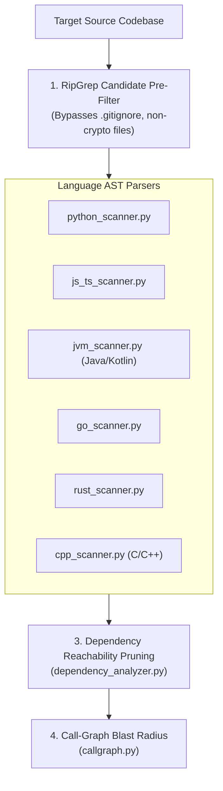

# Source Code & AST Analysis (`spectra.scanners.source`)

The `spectra.scanners.source` package delivers semantic Abstract Syntax Tree (AST) analysis, call-graph reachability pruning, and dependency auditing across **9 programming ecosystems**. It completely eliminates the 70%+ false positive rates plaguing conventional regex-based SAST tools.

---

## Architecture Overview

---

## Core Engine Modules

| Module | Purpose |
| :--- | :--- |
| [`__init__.py`](file:///C:/Users/Arnesh/spectra/spectra/scanners/source/__init__.py) | **`SourceScanOrchestrator`**: Dispatches language scanners, coordinates the ripgrep candidate filter, and unifies source findings. |
| [`base.py`](file:///C:/Users/Arnesh/spectra/spectra/scanners/source/base.py) | **Abstract Contract**: Defines `BaseSourceScanner` and the unified `SourceFinding` data model (algorithm, primitive, key length, mode, line range, call depth). |
| [`rules.py`](file:///C:/Users/Arnesh/spectra/spectra/scanners/source/rules.py) | **Rule Engine**: Loads and parses external YAML catalogs (`algorithms.yaml`, `libraries_*.yaml`, `dependencies.yaml`), compiling regex signatures and method call patterns. |
| [`dependency_scanner.py`](file:///C:/Users/Arnesh/spectra/spectra/scanners/source/dependency_scanner.py) | **Manifest & Lockfile Auditor**: Parses dependencies across **7 package managers** (`package.json`, `pom.xml`, `build.gradle`, `Cargo.toml`, `go.mod`, `requirements.txt`, `vcpkg.json`, `.csproj`). |
| [`dependency_analyzer.py`](file:///C:/Users/Arnesh/spectra/spectra/scanners/source/dependency_analyzer.py) | **Reachability Pruner**: Cross-references imported third-party libraries against actual application AST calls to prune unreferenced dependencies. |
| [`callgraph.py`](file:///C:/Users/Arnesh/spectra/spectra/scanners/source/callgraph.py) | **Call-Graph Generator**: Traces direct ($X$) and indirect transitive ($Y$) function calls to establish the blast radius of each cryptographic primitive. |

---

## Language AST Scanners

| Language Ecosystem | Module | Targeted Cryptographic Frameworks |
| :--- | :--- | :--- |
| **Python** | [`python_scanner.py`](file:///C:/Users/Arnesh/spectra/spectra/scanners/source/python_scanner.py) | `cryptography` (Fernet, Hazmat, AES-GCM, RSA), `hashlib`, `hmac`, `Crypto.Cipher`, `paramiko`. |
| **JavaScript / TypeScript** | [`js_ts_scanner.py`](file:///C:/Users/Arnesh/spectra/spectra/scanners/source/js_ts_scanner.py) | Node.js `crypto`, WebCrypto API (`SubtleCrypto`), `jose`, `jsonwebtoken`, `crypto-js`. |
| **Java & Kotlin** | [`jvm_scanner.py`](file:///C:/Users/Arnesh/spectra/spectra/scanners/source/jvm_scanner.py) | Java Cryptography Architecture (JCA/JCE `Cipher`, `KeyPairGenerator`), Bouncy Castle PQC (Dilithium, Kyber), Google Tink AEAD. |
| **Go** | [`go_scanner.py`](file:///C:/Users/Arnesh/spectra/spectra/scanners/source/go_scanner.py) | Standard `crypto/*` (`crypto/aes`, `crypto/rsa`, `crypto/tls`), Cloudflare CIRCL PQC (`circl/kem/kyber768`, `circl/sign/dilithium`). |
| **Rust** | [`rust_scanner.py`](file:///C:/Users/Arnesh/spectra/spectra/scanners/source/rust_scanner.py) | `ring` (`signature::ED25519`, `aead::AES_256_GCM`), `aes-gcm`, `rsa`, `pqcrypto` crates. |
| **C / C++** | [`cpp_scanner.py`](file:///C:/Users/Arnesh/spectra/spectra/scanners/source/cpp_scanner.py) | OpenSSL `EVP` cipher engines (`EVP_aes_256_gcm()`, `EVP_PKEY_RSA`), `libsodium`, Open Quantum Safe (`liboqs`) C/C++ wrappers. |

---

## Key Technical Breakthroughs

1. **RipGrep Accelerated Filtering**: Evaluates files at gigabytes per second, instantly bypassing `.gitignore` files, non-crypto source, and dead documentation before triggering AST parsing.
2. **True Semantic AST Visitors**: Distinguishes active function calls (e.g. `Cipher.getInstance("AES/GCM/NoPadding")`) from variable names (`RSA_KEY_SIZE = 2048`) or comments (`// TODO: migrate from DES`).
3. **Call-Graph Reachability Pruning**: Eliminates vendor bloat by ensuring that if a library is declared in `package.json` or `Cargo.toml` but never invoked by application source code, it does not generate false alarms.
