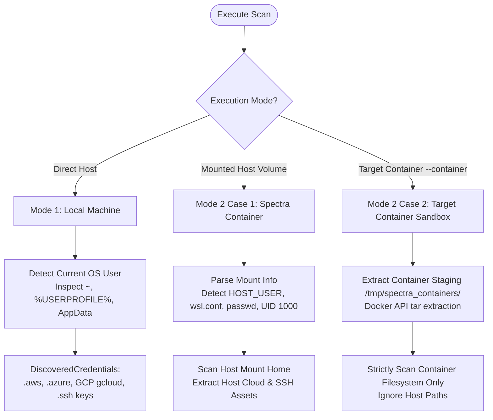

# SPECTRA // System Utilities & Low-Level Runtime Layer (`spectra/utils`)

## Overview

The `spectra.utils` subsystem provides essential low-level runtime services, environment discovery primitives, container interaction abstractions, and process execution primitives across Windows, Linux, macOS, WSL, and Docker containerized deployments.

Designed for robust operation across diverse environments, these utilities ensure zero external daemon crashes, safe subprocess execution, automatic host/container mount mapping, and intelligent cloud credential detection.

---

## Directory Architecture

```
spectra/utils/
├── __init__.py                # Package exports
├── credential_locator.py      # Multi-mode cloud (AWS/Azure/GCP) & SSH key discovery
├── docker_client.py           # Zero-dependency Docker Engine API client via Unix socket
├── logger.py                  # Rich console formatting, loggers, and diagnostics
├── shell.py                   # Subprocess isolation, timeouts, and CLI binary wrappers
└── system_paths.py            # Mount discovery, root resolution, and config heuristics
```

---

## Module Breakdown

### 1. `credential_locator.py` — Dynamic Multi-Mode Credential Discovery

Locates active cryptographic identities and cloud credentials across three primary execution paradigms without requiring manual path specification:



- **Mode 1 (Direct Host)**: Native Windows, macOS, or Linux execution. Inspects `$USER`, `$USERNAME`, `getpass.getuser()`, resolving `~/.aws`, `~/.azure`, `~/.config/gcloud`, `%APPDATA%\gcloud`, and `~/.ssh/`.
- **Mode 2 - Case 1 (Mounted Host in Container)**: Spectra container running with host volume mounts (e.g. `/scan`). Determines host user via:
  1. Priority A: Environment variable `HOST_USER` (passed via `docker run -e HOST_USER=$USER`).
  2. Priority B: Path hierarchy analysis of the target scan directory.
  3. Priority C: Heuristic detection via `/etc/wsl.conf` (`default`), `/etc/passwd` (UID 1000), or `.bash_history` / `NTUSER.DAT`.
- **Mode 2 - Case 2 (Target Container Audit)**: When running with `--container <name/id>`, extracts and analyzes only the target container's isolated filesystem (via Docker Engine API or `/tmp/spectra_containers/<name>`), strictly ignoring host credentials to prevent false cross-boundary leakage.

---

### 2. `docker_client.py` — Zero-Dependency Docker Engine Client

Direct Unix socket client connecting directly to `/var/run/docker.sock` using standard library Python (`http.client` + `socket.AF_UNIX`).

#### Key Features:
- **Zero Third-Party Dependencies**: Avoids bulky Docker SDK or Docker CLI binaries inside minimal audit containers.
- **Direct Tarball Streaming**: `extract_container_fs()` downloads file trees directly from container root paths using `GET /containers/{id}/archive` and streams them into memory or temporary inspection staging directories.
- **Process & Metadata Inspection**: Retrieves container environment variables, mounted volumes, open ports, and operating status via `inspect_container()`.

```python
from spectra.utils.docker_client import DockerContainerClient

client = DockerContainerClient("/var/run/docker.sock")
if client.is_available():
    containers = client.list_containers()
    meta = client.inspect_container("payment-service")
    target_dir = client.extract_container_fs("payment-service", "/app", "/tmp/extracted")
```

---

### 3. `system_paths.py` — Mount Resolution & Path Normalization

Resolves file system path differences between Windows drive letters (`C:\`), WSL translation paths (`/mnt/c`), container mount points (`/scan`), and process roots (`/proc/<pid>/root`).

#### Capabilities:
- **Root Mount Discovery**: `discover_root_mounts(target_dir)` crawls path ancestry to identify container proc roots, staging directories, Docker bind-mounts, and native drives.
- **Standard Configuration Discovery**: Automatically resolves standard configuration directories for:
  - **Web & Proxy Servers**: `/etc/nginx/`, `/usr/local/nginx/conf/`, `/etc/apache2/`, `/etc/httpd/`.
  - **OpenSSL & Cryptography**: `/etc/ssl/`, `/usr/lib/ssl/`, `/etc/pki/tls/`, `/etc/pki/ca-trust/`.
  - **Certificate Stores**: `/etc/ssl/certs/ca-certificates.crt`, Windows CryptoAPI cert roots.
- **Multi-Port & Endpoint Parsing**: Decodes and standardizes network target syntax (`host:port`, IP ranges, CIDR notations).

---

### 4. `shell.py` — Subprocess Execution & Binary Resolution

Safely coordinates shell interactions with low-level command-line utilities (such as `nmap`, `openssl`, `rg`, `readelf`, `ldd`, `strings`):

- **Path Verification**: `command_exists(name)` verifies tool availability before spawning processes.
- **Process Isolation**: Enforces timeout limits (`timeout=60`) and captures both standard output and error output to prevent pipe buffer deadlocks.
- **Safe Exit Code Handling**: Returns uniform tuples `(exit_code, stdout, stderr)` without raising unhandled exceptions on non-zero exit codes.

---

### 5. `logger.py` — Terminal Output & Diagnostic Reporting

Centralized logging engine built on [Rich](https://github.com/Textualize/rich):
- **High-Definition ASCII Banner**: Visual branding for CLI initialization.
- **Colored Status Highlights**: Warning panels, vulnerability tags, and progress indicators.
- **Encoding Defense**: Automatically reconfigures `sys.stdout` and `sys.stderr` to UTF-8 on Windows terminals to prevent `UnicodeEncodeError` when emitting cryptographic symbols and status badges.
